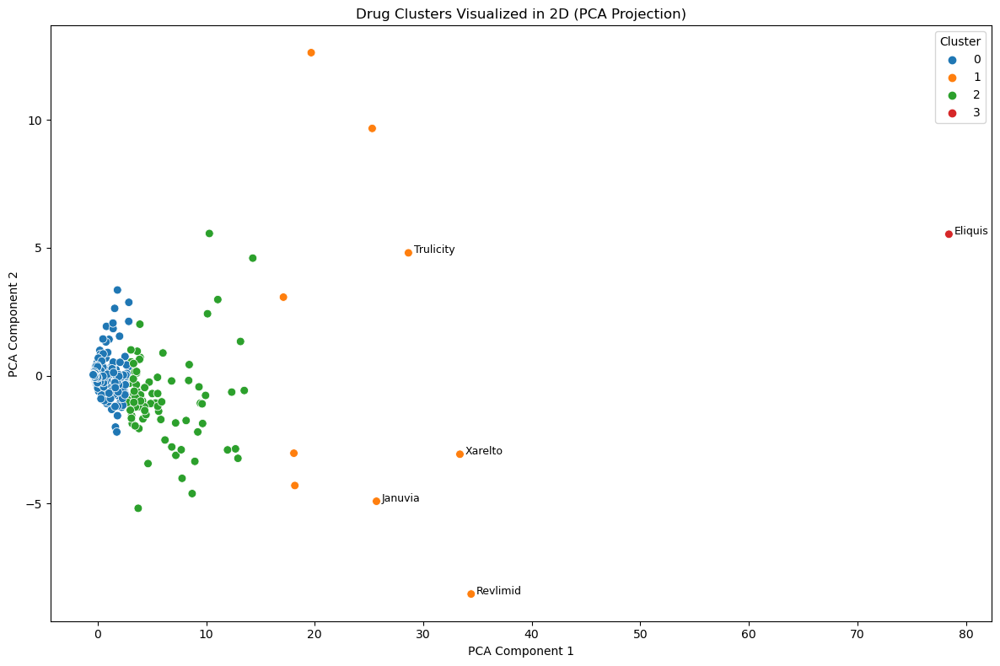
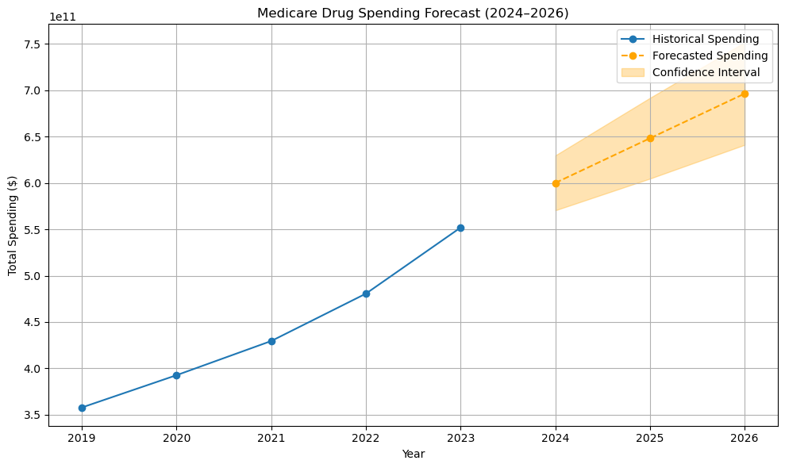

---

## 🧰 Technologies & Tools Used

- **Python** (Pandas, NumPy, Matplotlib, Seaborn)
- **scikit-learn** for clustering
- **ARIMA (Statsmodels)** for forecasting
- **Prophet (optional)** for alternate forecasting
- **Jupyter Notebook** for analysis
- **Git/GitHub** for version control

---

## 📊 Exploratory Data Analysis (EDA)

### ✔️ Key Findings:

- **Total Medicare drug spending has increased** consistently from 2019 to 2023.
- **Top drugs** like *Ozempic*, *Eliquis*, *Jardiance*, and *Trulicity* show explosive YoY growth.
- Manufacturer-wise analysis showed a **few pharma companies dominating spending**, with notable growth from diabetes and cardiovascular drug makers.

### 📈 EDA Graph Example:


---

## 📦 Clustering of Drugs

### ✔️ Objective:
Group drugs based on their annual spending profiles using **K-Means Clustering**.

### ✔️ Clustering Insights:

- **Cluster 0**: Low/moderate spending drugs grouped tightly.
- **Cluster 1**: High-growth outliers like *Ozempic*, *Jardiance*, *Trulicity*.
- **Cluster 2**: Mid-spending consistent drugs.
- **Cluster 3**: Extreme outlier (*Eliquis*) dominating total spend.

### 📌 Clustering PCA Plot:



---

## 📈 Trend Analysis

### ✔️ Drug-Level Trends:
- **Top 5 Fastest-Growing Drugs (by CAGR)**: Ozempic, Farxiga, Jardiance, Mounjaro, Skyrizi.
- **Declining Drugs**: Revlimid and similar brands are seeing drops due to generics/expiry.

### 📌 Manufacturer Trend Plot:


---

## ⏳ Forecasting (2024–2026)

### ✔️ Objective:
Predict Medicare drug spending for 2024–2026 using ARIMA.

### ✔️ Forecast Result:

- **2024 Projected Spend**: ~$600 billion
- **2025 Projected Spend**: ~$650 billion
- **2026 Projected Spend**: ~$700 billion
- **Trend**: Continued exponential growth in healthcare expenditure

### 📌 Forecasting Graph:



---

## 🧠 Key Takeaways

- 📈 **Spending is becoming more concentrated** in fewer high-demand drugs.
- 💊 **Diabetes, heart, and kidney medications are leading the growth**.
- 📉 **Some older drugs are declining**, hinting at patent expirations or better alternatives.
- 🧪 **Forecasts show an urgent need** for cost control or reimbursement reforms.

---

## 🚀 How to Run the Project

1. Clone the repo:
   ```bash
   git clone https://github.com/your-username/medicare-drug-spending-analysis.git
   cd medicare-drug-spending-analysis
